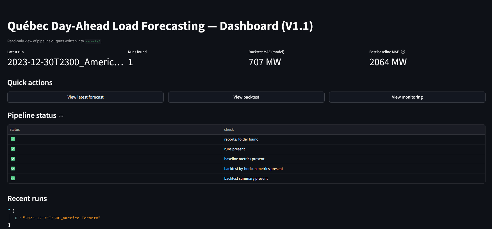
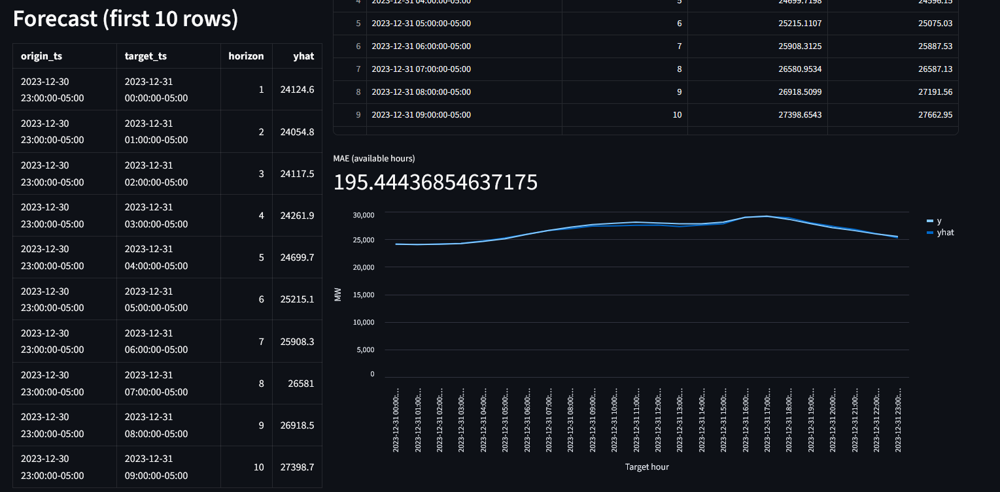
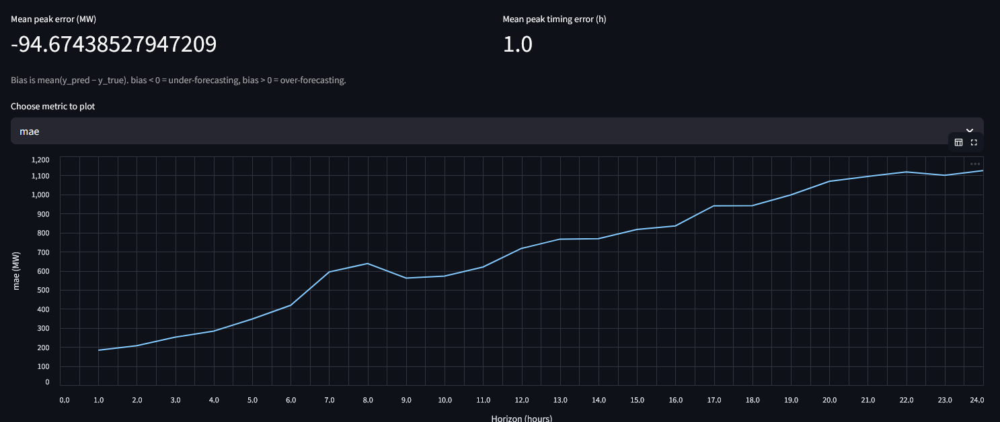

# Québec Day-Ahead Electricity Demand Forecasting (V1.1)

Day-ahead (next 24h) forecasting of **Hydro-Québec system load** using demand history, calendar signals, and temperature features (**non-leaky forecast proxy**).

Built as a **simple pipeline with serious evaluation**:
- Strong baselines (weekly naive, weekly average)
- Leakage-safe feature building (walk-forward setup)
- **Direct multi-step** forecasting: 24 specialist models (h=1..24)
- Backtest metrics by horizon + operational metrics (WAPE, bias, peak error)

## Dashboard (Streamlit)
| Home | Forecast | Backtest |
|---|---|---|
|  |  |  |

## Data

### Hydro-Québec demand (hourly historical)
Dataset: `historique-demande-electricite-quebec` (Hydro-Québec open data).

**Important timestamp detail:** Hydro-Québec labels each hourly value at the **end of the hour** (e.g., the value at `02:00` corresponds to roughly `01:00–02:00`).  
In `clean_align.py`, timestamps are shifted by **-1 hour** to make our canonical index **start-of-hour** (e.g., `02:00 → 01:00`) and then reindexed to a continuous hourly timeline.

### Hydro-Québec demand (live / V1.2 later)
Dataset: `demande-electricite-quebec` (15‑minute updates). This will be used later for the live loop.

### Weather
We ingest hourly `temperature_2m` and align it to the same hourly timestamp index.

---

## Problem framing

### Task
At a daily forecast origin, predict the next **24 hourly** demand values (day-ahead).

### Method summary
1) Build two baselines (no ML):
   - **weekly_naive_lag168**: tomorrow hour ≈ same hour last week
   - **weekly_avg_k4**: tomorrow hour ≈ average of same hour over last 4 weeks
2) Train the main ML model:
   - **Direct multi-step**: 24 separate “specialist” regressors (horizons 1…24)
   - Learner: **LightGBM**
3) Evaluate using walk-forward backtesting.

---

## Weather handling (day-ahead, no leakage)

We *do not* use tomorrow’s observed temperature when predicting tomorrow (that would be leakage).

Instead, we create a **forecast temperature proxy** using only past observed temperatures:

**Proxy (hourly, for target hour on D+1):**  
`temp_fcst_proxy(D+1, h) = mean( temp_obs(D, h), temp_obs(D-1, h), … , temp_obs(D-6, h) )`

In other words: **7‑day average of the same hour**, ending at the forecast origin day.

This provides a realistic “known-at-forecast-time” temperature input without requiring archived forecast vintages.

---

## Backtesting protocol (V1.0)

- Forecasting method: **Direct multi-step** (24 specialists, horizons 1…24)
- Backtesting: **walk-forward / rolling-origin**, expanding window
- Forecast origin: **daily at 23:00** (end of day D)
- Target window per fold: **next 24 hours** (D+1 00:00 → 23:00)
- Evaluation span: **90 daily folds** (configurable)

**Metrics:**
- **MAE (MW)**: average absolute error (typical miss)
- **RMSE (MW)**: penalizes big misses more
- **WAPE (%)**: total absolute error divided by total actual load (scale-free)
- **Bias (MW)**: mean(pred − actual)  
  bias < 0 → under-forecasting on average; bias > 0 → over-forecasting
- **Peak error (MW)**: predicted daily peak − actual daily peak  
  negative → peak underestimated; positive → peak overestimated
- **Peak timing error (hours)**: predicted peak hour − actual peak hour  
  0 → correct peak hour; positive → predicted peak late; negative → early

---

## Results (V1.1)

All results use the same forecasting contract: **issue at 23:00 (America/Toronto)** and predict **the full next day (00:00 → 23:00)**.

**Metric notes**
- **MAE / RMSE / Bias / Peak error** are in **MW**
- **WAPE** is shown as a **percentage**
- **Bias = mean(y_pred − y_true)** → bias < 0 means under-forecasting on average

### Baselines (no ML)

These are strong seasonal benchmarks. (Minor differences in `n_points` are due to a few missing hourly targets.)

- **Weekly naive (lag 168)**  
  MAE **2064.35 MW**, RMSE **2723.13 MW**, WAPE **8.99%**, Bias **−547.87 MW**, Peak error **−563.11 MW**, Peak timing error **−0.01 h**

- **Weekly average (k=4)**  
  MAE **2363.54 MW**, RMSE **3068.08 MW**, WAPE **10.29%**, Bias **−1662.83 MW**, Peak error **−1926.56 MW**, Peak timing error **+1.40 h**

**Interpretation:** weekly-average smooths too much → it underestimates peaks and shifts peak timing. Weekly-naive is the stronger baseline here.

### LightGBM (Direct 24 specialists)

- **Overall (90 folds, 2160 points):**  
  MAE **706.868 MW**, RMSE **1023.794 MW**, WAPE **3.09%**, Bias **−21.671 MW**  
  Peak error (mean) **−94.674 MW**, Peak timing error (mean) **+1.0 h**

- **Skill vs strongest baseline (weekly naive):**  
  MAE improves by **~65.8%** (WAPE improves by **~65.6%**).

Notes:
- Error increases with horizon (farther into tomorrow is harder); worst horizons are typically **18–24**.
- Tuning note: `num_leaves=128` improved MAE to ~**706 MW**.

See `RESULTS.md` for the full horizon table + diagnostics.

---

## Repo structure (key files)

- `src/ingest_hq_demand.py` — download HQ hourly historical demand (raw)
- `src/clean_align.py` — timezone + end-of-hour → start-of-hour alignment + hourly reindex
- `src/ingest_weather.py` — ingest hourly temperature and align timestamps
- `src/build_features.py` — calendar + lags + rolling means + weather proxy features
- `src/run_baselines.py` — seasonal naive baselines backtest
- `src/run_backtest.py` — ML walk-forward backtest (LightGBM, 24 specialists)
- `src/train_models.py` — train final 24 specialist models and save to `models/`
- `src/predict_next_day.py` — generate a “forecast run” artifact folder (demo)

Artifacts:
- `reports/backtest/` — baseline + model backtest summaries
- `data/forecasts/runs/` — forecast-run folders (inputs + predictions)

---

## How to reproduce (minimal)

1) Ingest + clean demand  
- `python src/ingest_hq_demand.py`  
- `python src/clean_align.py`

2) Ingest weather + build features  
- `python src/ingest_weather.py`  
- `python src/build_features.py`

3) Backtests  
- `python src/run_baselines.py`  
- `python src/run_backtest.py`

4) Train final models  
- `python src/train_models.py`

---

## Roadmap

### V1.1 (done)
- Streamlit dashboard (Forecast / Backtest / Monitoring scaffolding)
- Added industry-standard metrics: **WAPE, Bias, Peak error, Peak timing**
- Forecast page: plot **prediction vs actual** for the 24-hour next-day window
- Backtest page: horizon plot + baseline comparison callout

### V1.2 (next: make it “live”)
- Daily run automation: generate next-day forecast at fixed issue time
- Auto-evaluation: as actuals arrive, score forecasts and update dashboard artifacts
- Retraining policy: weekly retrain + optional retrain trigger on large error spikes
- Hosted dashboard (Streamlit Community Cloud)

### V1.3 (probabilistic + monitoring)
- Quantile forecasts (P10/P50/P90)
- Monitoring tab: coverage, interval width, anomaly flagging when actuals fall outside the band

---

## License
MIT
